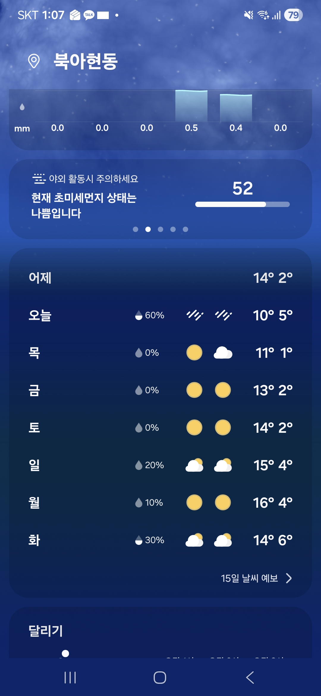
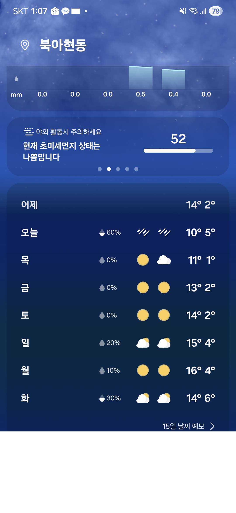
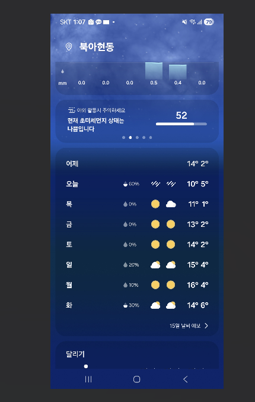
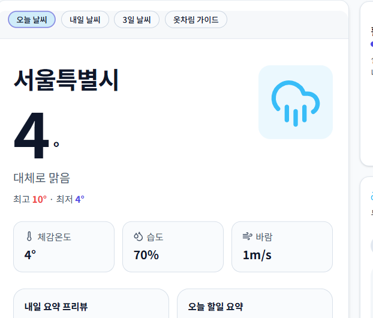
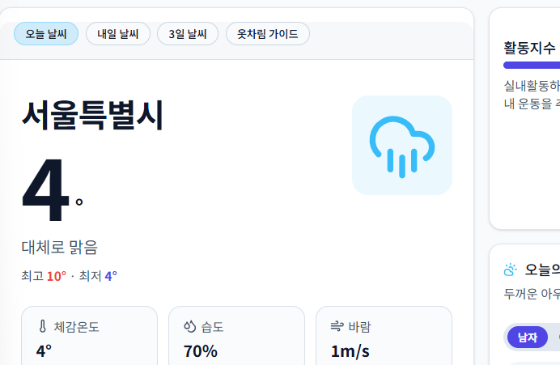
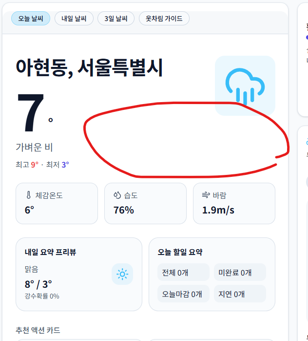

# 개발·배포 트러블슈팅 회고

> **단일 문서:** 이 파일이 프로젝트 트러블슈팅·회고의 기준 문서입니다.  
> 루트의 `troubleshooting-auth.md`는 여기로 연결만 합니다.

## 개요 (인증 이슈)

- 대상 프로젝트: AI Todo 웹 서비스
- 이슈 요약:
  - 로그아웃 후 페이지 전환이 멈추고 렌더링만 지속됨
  - 로그인 성공 후에도 메인 페이지 전환이 불안정함
  - 특정 시점에서 `Internal Server Error` 발생

## 주요 증상

- `/`와 `/login` 사이를 반복 요청하는 패턴
- 로그인 폼 요청이 `GET /login?email=...&password=...` 형태로 나타남
- 서버 로그에 `.next` 산출물 접근 오류(`page_client-reference-manifest.js`) 발생
- 개발 서버 `lock` 충돌로 `next dev` 중복 실행 에러 발생

## 원인 진단

### 1) 인증 리다이렉트 충돌

- 클라이언트(`useEffect`, `onAuthStateChange`)와 서버(`middleware`)가
  동시에 인증 라우팅을 강제하면서 타이밍 충돌이 발생했다.

### 2) 폼 기본 제출 방식 이슈

- 로그인 폼이 기본 GET 제출로 동작할 가능성이 있어 URL query가 오염되고
  상태 전환 흐름을 불안정하게 만들었다.

### 3) 개발 캐시 손상

- `.next` 내부 manifest 파일 접근 오류로 `Internal Server Error`가
  발생해 인증 이슈와 별개로 렌더링 장애를 유발했다.

### 4) 개발 서버 중복 실행

- 이미 실행 중인 `next dev` 프로세스가 포트/lock을 점유해
  재실행 시도 때 문제를 증폭시켰다.

## 수행한 조치

1. 개발 서버 충돌 정리
   - 포트 점유 프로세스 종료 후 재실행
2. Turbopack 경로 이슈 우회
   - `next dev --webpack` 적용
3. 인증 기능 구현
   - `signInWithPassword`, `signUp`, `signOut` 연결
4. 인증 상태 관리 강화
   - `getSession()` 기반 초기 확인
   - `onAuthStateChange` 구독 적용
5. 라우팅 충돌 완화
   - `middleware` 범위를 `/` 보호 중심으로 축소
6. 전환 안정화
   - 로그인/회원가입/로그아웃 성공 시 `window.location.assign(...)` 사용
   - 로그아웃 타임아웃 안전장치 추가
7. 캐시 복구
   - `.next` 삭제 후 dev 서버 클린 재기동

## 최종 안정화 포인트

- 서버단 가드와 클라이언트 가드를 동시에 과도하게 강제하지 않는다.
- 보호 라우트는 서버단에서 명확히 제어한다.
- 인증 직후 전환은 하드 네비게이션으로 확정해 상태 꼬임을 줄인다.
- 문제가 재현되면 라우팅 로그와 `.next` 상태를 먼저 분리 확인한다.

## 재발 방지 체크리스트

- [ ] `next dev` 중복 실행 여부 확인
- [ ] `.next` 캐시 손상 여부 확인
- [ ] 폼 제출 방식(`method="post"`) 명시 확인
- [ ] 인증 라우팅 책임(서버/클라이언트) 중복 여부 점검
- [ ] 로그인/로그아웃 E2E 시나리오 수동 테스트

## 빠른 대응 가이드

1. `lock` 에러 발생 시
   - 기존 `node` 프로세스 종료 후 `npm run dev`
2. `Internal Server Error` 반복 시
   - 서버 종료 -> `.next` 삭제 -> 재실행
3. 로그인/로그아웃 전환 멈춤 시
   - 네트워크 탭에서 `/` ↔ `/login` 반복 요청 확인
   - 인증 가드 충돌 여부 점검

---

## 배포(Vercel)·환경 변수·OS 차이 (회고)

### 배경

- 로컬(`next dev`, `npm run start`)에서는 정상이었으나 **Vercel 배포**에서만
  실시간 날씨(`/api/weather`) 연동이 실패하고,
  UI에 *「실시간 날씨를 불러오지 못해 기본 데이터를 표시합니다.」* 가 표시됨.

### 증상 정리

- 브라우저 Network: `GET /api/weather?...` 가 **4xx/5xx** 또는 에러 바디
- 서버 라우트는 `process.env.WEATHERAPI_KEY` 없으면 500 응답
  (`app/api/weather/route.ts`)

### 원인: 환경 변수 **이름 대소문자** — Windows vs Linux

| 환경 | 동작 |
|------|------|
| **Windows 로컬** | Node에서 환경 변수 **키를 대소문자 구분 없이** 다루는 경우가 많음.  
  예: `.env.local`에 `weatherAPI_KEY`만 있어도 `process.env.WEATHERAPI_KEY`로 읽히는 것처럼 보일 수 있음. |
| **Linux (Vercel)** | 환경 변수 키가 **완전 일치**해야 함.  
  `weatherAPI_KEY` ≠ `WEATHERAPI_KEY` → 후자는 `undefined` → 배포에서만 실패. |

즉 **오타라기보다 “로컬 OS와 배포 OS의 env 규칙 차이”**로,  
같은 `.env`를 Vercel에 Import 해도 **이름이 코드와 1글자라도 다르면** 운영에서만 터질 수 있다.

### 수행한 조치

1. Vercel `Environment Variables` 이름을 코드와 동일하게 **`WEATHERAPI_KEY`** 로 통일
2. (권장) 로컬 `.env.local`도 동일 스펠링으로 맞춰 **Windows·Linux 모두 동일 동작** 보장
3. 변수 추가/이름 변경 후 **재배포(Redeploy)**

### 보안 메모

- API 키가 스크린샷/채팅 등에 노출되었다면 **재발급·이전 키 폐기** 검토

### 재발 방지 체크리스트 (배포)

- [ ] Vercel 변수명이 코드의 `process.env.***` 와 **대소문자까지 동일**한지
- [ ] Production / Preview 등 **적용 환경**에 들어갔는지
- [ ] 변경 후 **재배포** 했는지
- [ ] Network에서 `/api/weather` 응답 코드·바디로 서버 오류인지 구분했는지

---

## Windows 로컬 dev: Internal Server Error / 청크 500

터미널에 다음과 비슷한 로그가 나오면 **Webpack dev + Windows 파일 잠금(AV/동기화)** 조합일 수 있습니다.

`UNKNOWN: unknown error, open '...\.next\dev\server\vendor-chunks\next.js'` (errno **-4094**)

### 조치

1. **`npm run dev`** 는 이 프로젝트에서 **기본(Turbopack)** 으로 실행됩니다. (Webpack은 `npm run dev:webpack`)
2. dev 서버 종료 후 **`.next` 삭제** → `npm run dev` 또는 `npm run dev:clean`
3. 그래도 동일하면 **Windows Defender**에서 프로젝트 폴더(또는 최소 `.next`) **제외**, **OneDrive 동기화** 대상에서 제외 검토
4. 예전 탭은 닫고 **강력 새로고침**(캐시 비움)
